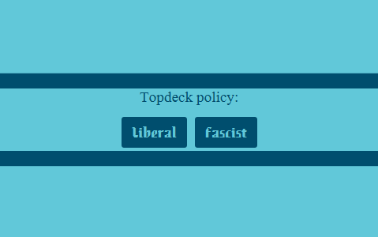

# SecretHitler

This program is a utility program for the boardgame [Secret Hitler](https://www.secrethitler.com/).
It's main use is keeping track of past governments, top decks, votes, etc.

## Start screen

---

On startup, the start screen is shown. Here you can choose from a few options.
- Start a new game, this opens the [configuration screen](#configuration-screen)
- Load a finished game to view the results, opens the [interface](#interface) (*WIP*)
- Open settings menu (*WIP*)
- Enable/Disable styling switch when fascist role is chosen (*WIP*)

## Configuration screen

---

When "new game" is chosen, the configuration screen is shown. 
Here you can select how many player you are playing with and enter player names.
You can play anonymous by creating a game now, or select which player represents you.

### Role selection

When an active player is chosen, you have to select which role you have.

If your role is fascist (or hitler with less than 7 players) 
you have to enter which players are fascist and who's hitler.
If style switch is enabled, and you select a fascist role, the theme switches to red. 
This option can always be turned off in the settings (*WIP*). 
This styling switch carries on to the main [interface](#interface), so be careful if people could
see the light from your screen.

When all players names have been entered and all roles have been selected (if needed), 
the create game button is enabled, allowing you to start the game.

## Interface

---
If either a new game is created or a game is loaded, the main interface is shown.
For a new game, the interface is initially empty:

The interface consists of four different parts:
- [Government creation panel](#government-creation-panel) (bottom left)
- [Government history](#government-history) (top left)
- [Party overview](#party-overview) (top right)
- [Government details](#government-details) (bottom right)

### Government creation panel

This panel is used for creating new governments. 
To create a government, select a president and a chancellor, 
then enter the claims of both. If the claims match you don't need to enter the chancellor's
claim because it's generated to match the president's claim. If there's a conflict
between both claims, tick the conflict box. Finally, select which players chose nein (no)
and press "create gov". Failed governments cannot be entered. If a top-deck occurs 
press the "Top deck" button. This shows a window in the [top-left](#top-deck) part of the interface.

### Government history

Initially this table is empty, but when a government is created, it is shown in the government history.
The chosen president and chancellor are shown, together with the claim of the government. If a conflict
has occurred, this is indicated by a lightning bold and both the claim of the president and chancellor are shown.
The last column shows the assumption of which cards where drawn.

A government can be selected and when selected, the [party overview](#party-overview) shows the votes for that government and
the [government details](#government-details) panel shows more information about the government.

#### Top deck

If the "top deck" button was pressed this part of the screen shows the top deck window.

You can simply choose which policy was chosen. Alternatively, the "top deck" button is replaced with "cancel"
to hide this window. Top decks are also shown in the government history.

### Party overview

This is an overview of every player in the game. You can select a suspected role for each player at any time.
This also changes their role card. When a government is selected in the [government history](#government-history), a green or red
box is shown next to the player's name. This represents their vote for that government.

If you have chosen a role in the [configuration screen](#configuration-screen), your role is automatically set
and the box is disabled. When you are playing as fascist and all fascist roles where chosen, the entire
party's roles are set and disabled for change.

### Government details

This panel shows the current state of the board and lets you set the assumption for a government.
The board shown is the state of the board at the time of the selected government (powers *WIP*).
In the claims and assumptions tab, all possible sets are shown together with their chance of happening.
You can click the set assumption button to select the assumption for the selected government.

The "end game" button ends the game and saves it to view later.